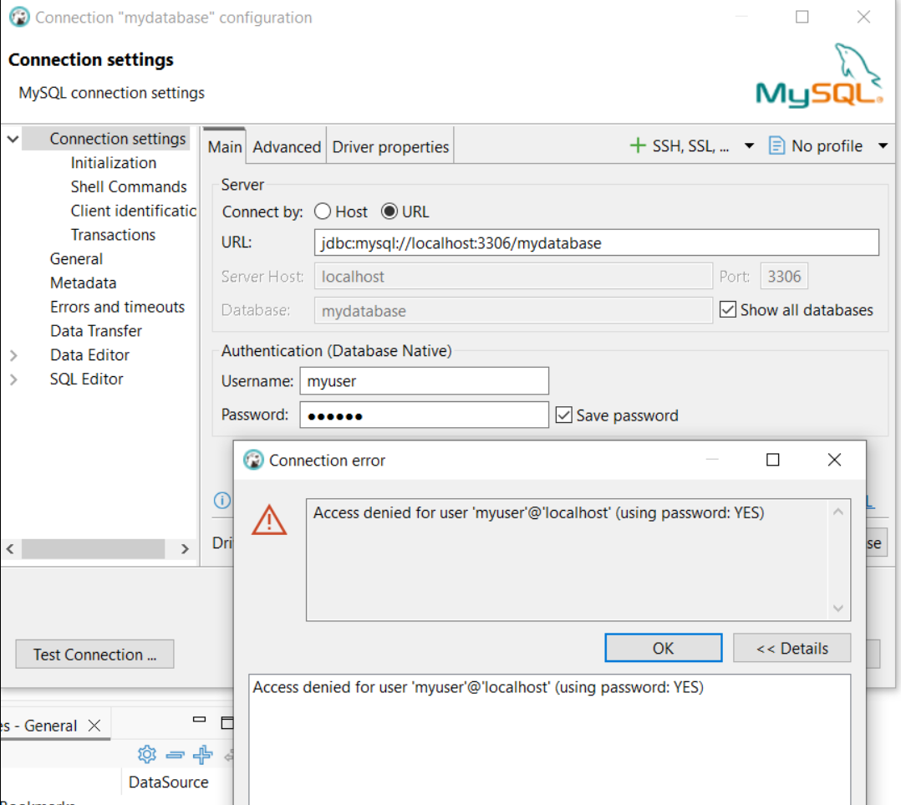
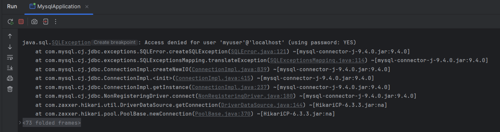

# spring_jdbc_mysql

# Projecte Spring JDBC MySQL – Gestió de Customers

## Introducció
Aquest projecte és una aplicació senzilla amb **Spring Boot** que utilitza **JDBC** per connectar-se a una base de dades **MySQL**. L'objectiu és demostrar el funcionament de diversos **endpoints CRUD** per gestionar una taula `customers`.

Els endpoints desenvolupats són:

1. Afegir usuaris de prova (`POST /jdbctemplate/add-sample-users`)
2. Crear un nou customer (`POST /api/customer`)
3. Llegir tots els customers (`GET /api/customer`)
4. Llegir un customer per ID (`GET /api/customer/{customer_id}`)
5. Actualització completa d’un customer (`PUT /api/customer/{customer_id}`)
6. Actualització parcial de l’age (`PATCH /api/customer/{customer_id}/age`)
7. Eliminar un customer (`DELETE /api/customer/{customer_id}`)

---

## Estat actual del projecte

Durant el desenvolupament i proves, **no ha estat possible establir connexió amb la base de dades MySQL**. Tots els intents de connexió amb l’usuari `myuser` i la base `mydatabase` han retornat un error d’accés denegat (`Access denied for user 'myuser'@'localhost'`).

### Captura de DBeaver
Aquí es mostra la captura de DBeaver intentant connectar-se a la base de dades sense èxit:

### Captura de Spring Boot a la terminal
Aquí es mostra la terminal amb l’inici de l’aplicació Spring Boot i l’error d’accés a la base de dades:

---

## Observacions
Tot i no haver pogut establir connexió amb la base de dades, l’estructura del projecte i els endpoints han estat implementats.

